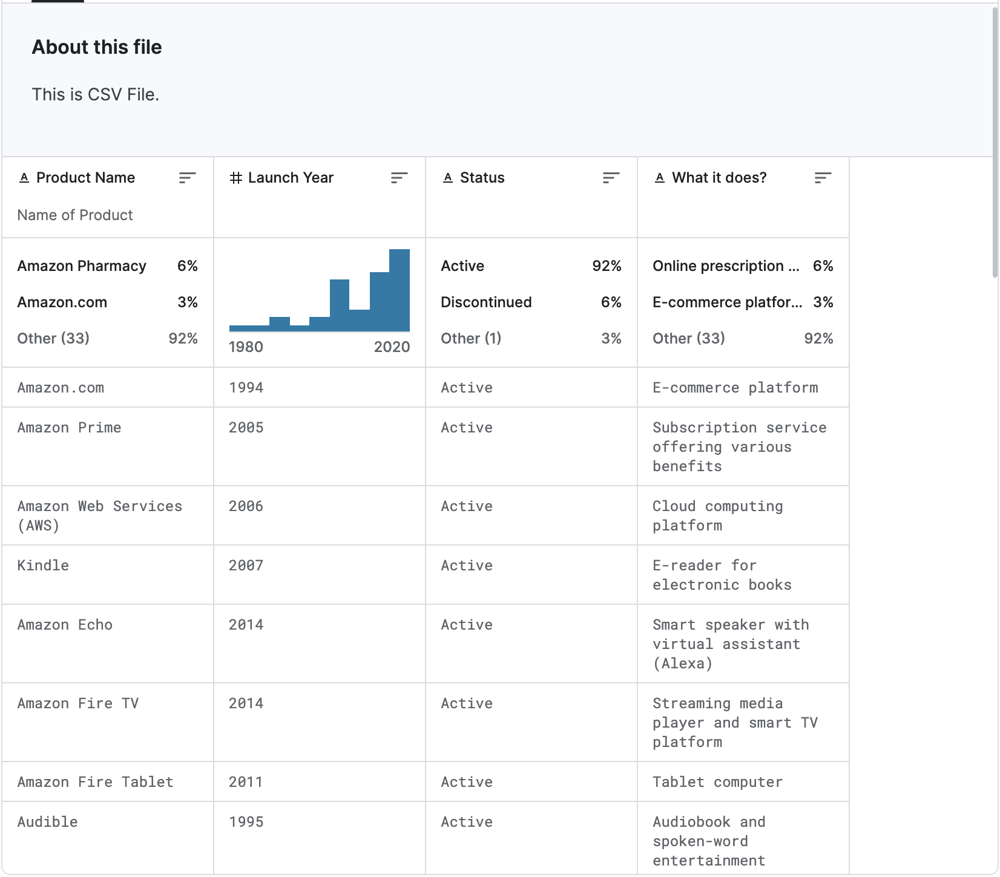

## Our dataset

List of Internet Products of Top Tech Companies contains product names, its launch year and what it (product) does. It contains data for YANDEX, MICROSOFT, TENCENT, BYTEDANCE, META, GOOGLE, AMAZON, BAIDU, APPLE. In this case we have the list of Apple Products.



```csv
Product Name,Launch Year,Status,What it does?
Macintosh,1984,Active,Personal computer
iPhone,2007,Active,Smartphone
iPad,2010,Active,Tablet computer
MacBook Air,2008,Active,Lightweight laptop
MacBook Pro,2006,Active,High-performance laptop
```

## Database model & DB description: Redis

As the Redis database model is a key-value store, where data is organized into key-value pairs. Each key is a unique identifier for a specific piece of data, and the corresponding value is the actual data associated with that key. Redis supports various data types for values, including strings, hashes, lists, sets, and more.

In the context of the script I provided earlier, the data is organized as follows:

- **Key:** Each product has a unique key in the form of "product:{Product}" where `{Product}` is the name of the product. For example, if the product is "iPad", the key would be "product:iPad".

- **Value (Hash):** The value associated with each key is a Redis hash. A hash is a collection of field-value pairs. In this case, the fields are "Year", "Active", and "Description", and the corresponding values are the data from the CSV file.

Here's how the data is structured in Redis:

```
Key: product:iPad
Value (Hash):
	- Field: Year, Value: 2010
	- Field: Active, Value: Active
	- Field: Description, Value: Tablet computer
```

## How to import from CSV to Redis

Migrating a database from CSV to Redis involves several steps. Redis is a key-value store, so you'll need to determine how to structure your data in Redis based on your specific use case. Here's a general guide on how to migrate a CSV database to Redis:

### Step 1: Install Redis

Make sure you have Redis installed on your system. You can download it from the official website: [Redis Downloads](https://redis.io/download).

### Step 2: Understand Your Data

Examine your CSV file and determine how you want to structure the data in Redis. Redis is a key-value store, so you need to decide what will be your keys and values. 

### Step 3: Convert CSV to Redis Data

Write a script or use a programming language (such as Python) to read the CSV file and convert it into Redis commands. The script should parse the CSV file, extract the relevant information, and generate Redis commands to set the key-value pairs.

Here's an example using Python and the `redis-py` library:

```python
import csv
import redis

# Connect to Redis
redis_host = 'localhost'  # Change this to your Redis server host
redis_port = 6379         # Change this to your Redis server port
redis_db = 0              # Change this to your Redis database index

redis_client = redis.StrictRedis(host=redis_host, port=redis_port, db=redis_db)

# CSV file path
csv_file_path = 'path/to/your/csvfile.csv'

# Function to migrate CSV to Redis
def migrate_csv_to_redis(csv_file_path):
	with open(csv_file_path, newline='', encoding='utf-8') as csvfile:
		csv_reader = csv.DictReader(csvfile)
		for row in csv_reader:
			product = row['Product']
			year = row['Year']
			active = row['Active']
			description = row['Description']

			# Assuming you want to use a Redis hash for each product
			redis_key = f"product:{product}"
			redis_client.hset(redis_key, 'Year', year)
			redis_client.hset(redis_key, 'Active', active)
			redis_client.hset(redis_key, 'Description', description)

if __name__ == "__main__":
	migrate_csv_to_redis(csv_file_path)

```

Make sure to customize this script based on your CSV file structure.

### Step 4: Run the Script

Execute the script to migrate the data. Ensure that your Redis server is running before running the script.

```bash
python csv_to_redis.py
```

### Step 5: Verify Data in Redis

Connect to your Redis server using the `redis-cli` tool or a Redis GUI and verify that the data has been successfully migrated.

```bash
redis-cli
127.0.0.1:6379> HGETALL your_key
```

Replace `your_key` with an actual key from your dataset.

### Step 6: Optimize for Redis Data Structures

Depending on your use case, you might want to optimize the data structure in Redis. For example, you could use sets, lists, or other Redis data types based on your specific requirements.

Remember to tailor the process to fit your particular use case and dataset structure. Additionally, be mindful of data types, serialization, and any specific requirements for your application.

## CRUD Operations

In Redis, CRUD (Create, Read, Update, Delete) operations are performed using various commands. Here's an example of how you can perform these operations using the Redis CLI (Command Line Interface):

Assuming you have the product "iPad" in your Redis database with the key "product:iPad" and the associated hash fields "Year," "Active," and "Description."

### 1. Create (C) - Set a new product:

```bash
# Syntax: HMSET key field1 value1 field2 value2 ...
HMSET product:iPad Year 2010 Active Active Description "Tablet computer"
```

This command sets the values for the fields in the hash associated with the key "product:iPad."

### 2. Read (R) - Retrieve information about a product:

```bash
# Syntax: HGETALL key
HGETALL product:iPad
```

This command retrieves all the fields and values for the hash associated with the key "product:iPad."

### 3. Update (U) - Modify information about a product:

```bash
# Syntax: HSET key field value
HSET product:iPad Year 2011
```

This command updates the value of the "Year" field for the product "iPad" to 2011.

### 4. Delete (D) - Remove a product:

```bash
# Syntax: DEL key
DEL product:iPad
```

This command deletes the entire key and its associated hash, effectively removing the product "iPad" from the database.

These are basic examples, and Redis offers a wide range of commands and features for more advanced use cases. Additionally, in a real-world application, you would likely perform these operations programmatically using a programming language and a Redis client library, as opposed to directly using the Redis CLI. The Python script provided earlier is an example of how you might do this programmatically.